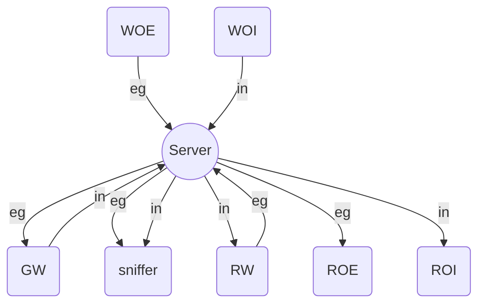
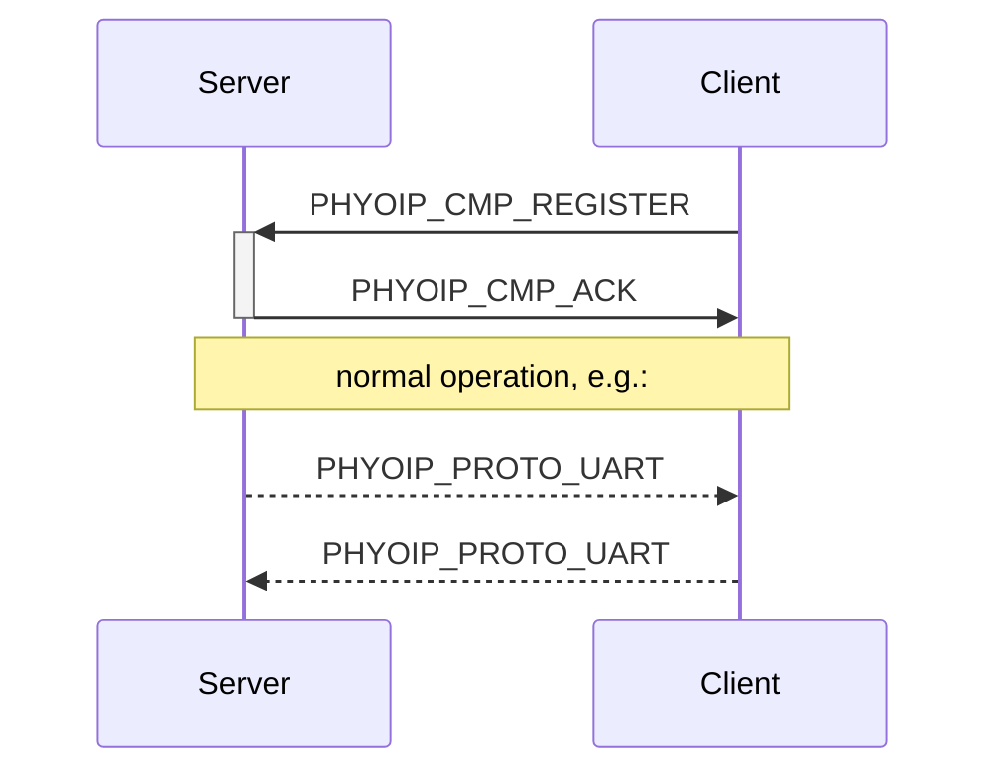
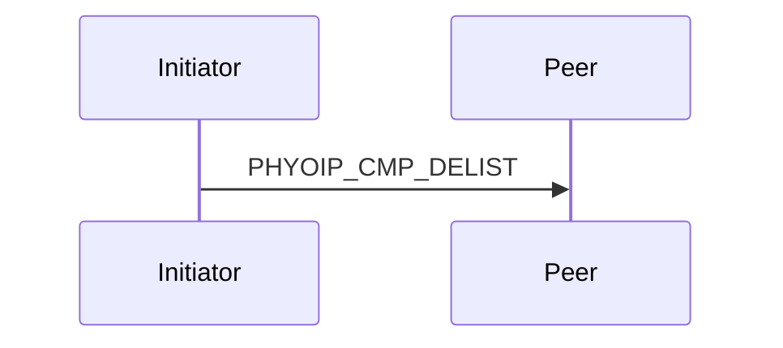

# PHYoIP Protocol

Specification and C headers for the TCP and UDP application protocols.

## Topology

| abbr. | Description                                                |
|:-----:|:-----------------------------------------------------------|
|  eg   | egress packages (i.e. from PC program to external device)  |
|  in   | ingress packages (i.e. from external device to PC program) |
|  GW   | gateway client                                             |
|  RW   | read/write client                                          |
|  RO*  | read-only client                                           |
|  WO*  | write-only client                                          |

Client types `PHYOIP_CT_...` are defined in [_phyoip/protocol/cmp.h_](./include/phyoip/protocol/cmp.h).

## Connection Establishment

## Connection Termination
A connection can be terminated by either the server or the client.

